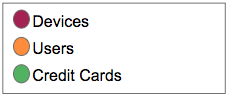

# Analyzing Fraud Networks

* [Project](https://bl.ocks.org/Italosayan/raw/c1c5f555c7a319d27f6362f3872270ac/)
* [Analysis](https://github.com/Italosayan/A2-D3.js/blob/master/ravelin/Fraud_analysis.pdf)

## Built With

* [D3](https://d3js.org/) - The graph web framework used

## Details

## Acknowledgments

* Ravelin for the data
* [Inspiration](https://bl.ocks.org/mbostock/1093130)
* etc
